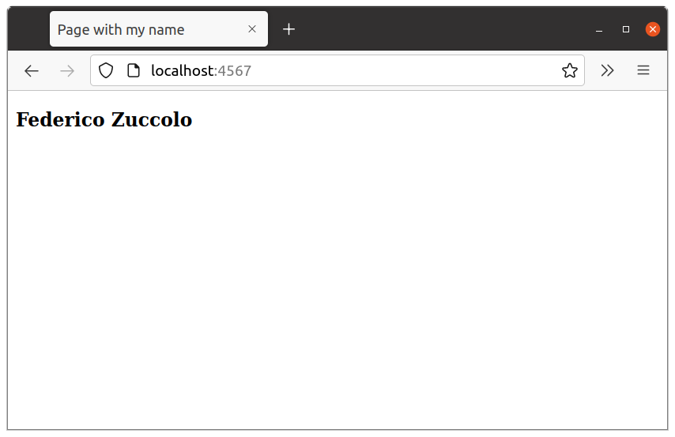

# Ejercicio 1

1. Crear una página con mi nombre:

        ./html/index.html

2. Descargar imagen de `nginx`:

        docker pull nginx:1.22.0

3. Iniciar instancia del servidor:

        $ cd ejercicio01

        $ docker run --rm --name zuccolo-nginx-instance -v $(pwd)/html:/usr/share/nginx/html -p 4567:80 -d nginx:1.22.0

3. Visitar URL local:

        http://localhost:4567

4. Resultado:

   

5. Parar instancia del servidor:

        docker stop zuccolo-nginx-instance
