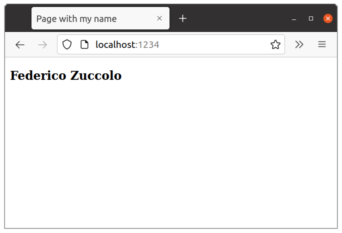

# Ejercicio 1

1. Crear una página con mi nombre:

        ./index.html

2. Crear el archivo `Dockerfile`:

        FROM nginx:1.22.0
        COPY ./index.html /usr/share/nginx/html/

3. Crear imagen:

        docker build -t zuccolo-ej01 .

4. Iniciar instancia del servidor:

        docker run --rm --name zuccolo-nginx-instance -d -p 1234:80 zuccolo-ej01

3. Visitar URL local:

        http://localhost:1234

4. Resultado:

   

5. Parar instancia del servidor:

        docker stop zuccolo-nginx-instance
