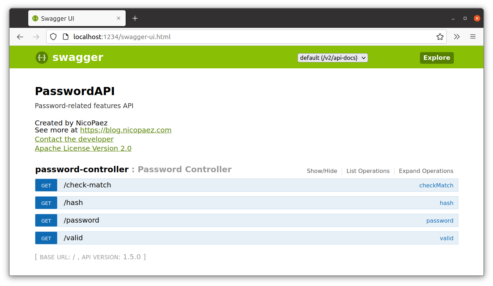

# Ejercicio 4


### A. Elección de la imagen base

Criterios:

* Debe ser una imagen oficial
* Java RE instalado
* Dentro de lo posible, de poco tamaño

Partiendo de las [recomendaciones de OpenJDK](https://hub.docker.com/_/openjdk?tab=description), la imagen elegida es `ibmjava:8-sfj`.

### B. Creación de la imagen

1. Crear el Dockerfile:

    ```dockerfile
    FROM ibmjava:8-sfj

    WORKDIR /usr/app
    COPY ./passwordapi.jar .
    EXPOSE 8080
    CMD ["java", "-jar", "passwordapi.jar"]
    ```

2. Crear la imagen:

        $ cd ./ejercicio04
        $ docker build -t fzuccolo/ej04:1.0 .

3. Publicar la imagen:

        $ docker push fzuccolo/ej04:1.0

### C. Utilizar la imagen

1. Descargar la imagen:

        $ docker pull fzuccolo/ej04:1.0

2. Iniciar el contenedor:

        $ docker run --rm --name zuccolo-ej04-instance -d -p 1234:8080 fzuccolo/ej04:1.0

3. Verificar funcionamiento de la aplicación:

    
