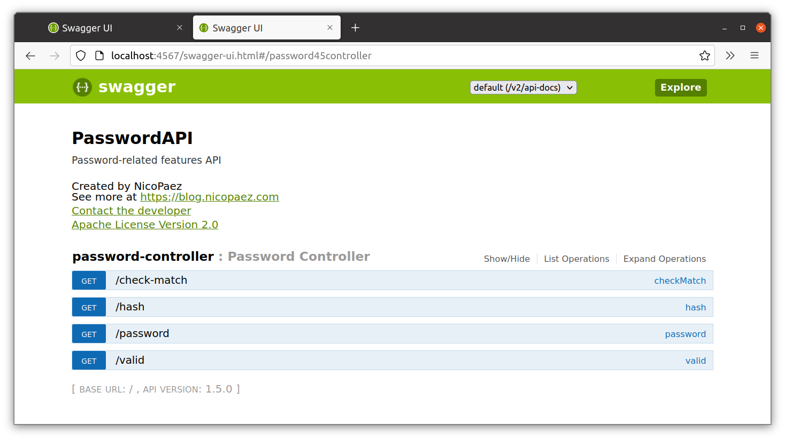

# Ejercicio 6

### Creación de la imagen

1. Crear el Dockerfile:

    ```dockerfile
    FROM registry.access.redhat.com/redhat-openjdk-18/openjdk18-openshift:1.12

    WORKDIR /usr/app
    COPY ./passwordapi.jar .
    EXPOSE 8080
    CMD ["java", "-jar", "passwordapi.jar"]

    ```

2. Crear la imagen:

        $ cd ./ejercicio06
        $ docker build -t fzuccolo/ej06:1.0 .

3. Publicar la imagen:

        $ docker push fzuccolo/ej06:1.0

### Utilización de la imagen

1. Descargar la imagen:

        $ docker pull fzuccolo/ej06:1.0

2. Iniciar el contenedor:

        $ docker run --rm --name zuccolo-ej06-instance -d -p 4567:8080 fzuccolo/ej06:1.0

3. Verificar funcionamiento de la aplicación:

    
