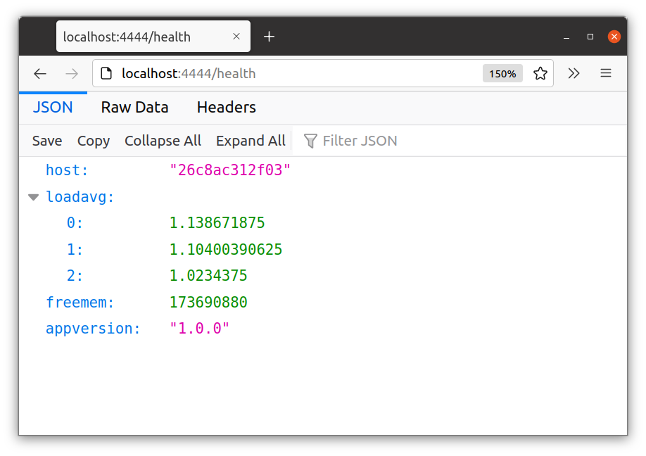
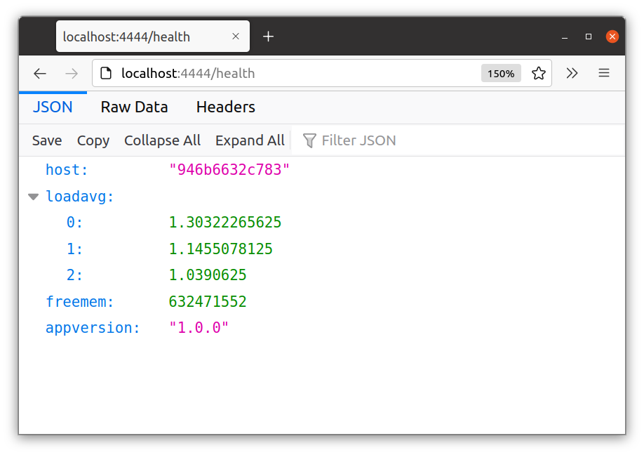

# Ejercicio 8

1. Crear `docker-compose.yml`:

    ```yaml
    version: '3'
    services:

      app1:
        image: nicopaez/password-api
        expose:
        - '3000'

      app2:
        image: nicopaez/password-api
        expose:
        - '3000'

      nginx:
        image: nginx:1.22.0
        ports:
        - 4444:80
        volumes:
        - './nginx.conf:/etc/nginx/nginx.conf:ro'
        depends_on:
        - app1
        - app2
    ```

2. Definir configuración de nginx en `nginx.conf`:

    ```js
    events {}

    http {

      upstream backend_ej8 {
        server app1:3000;
        server app2:3000;
      }

      server {
        location / {
          proxy_pass http://backend_ej8;
        }
      }

    }
    ```

3. Iniciar instancias

        $ cd ejercicio08
        $ docker-compose up

4. Visitar `localhost:4444/health` y verificar que cada solicitud es atendida alternadamente por `app1` y `app2`:

     


##### Referencias

* https://hub.docker.com/_/nginx
* https://docs.nginx.com/nginx/admin-guide/load-balancer/http-load-balancer/
* https://www.nginx.com/resources/wiki/start/topics/examples/loadbalanceexample/

