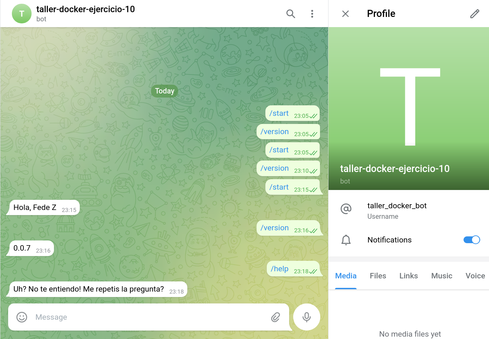
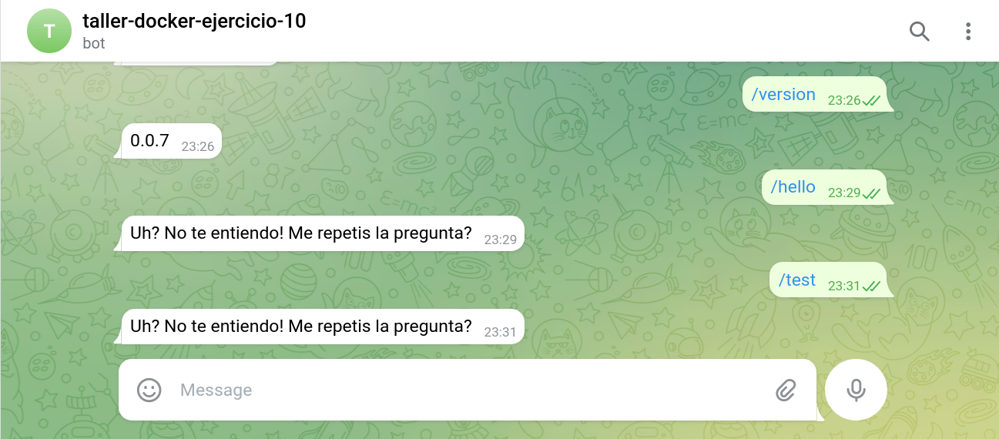

# Ejercicio 10

1. Crear el bot `@taller_docker_bot` en telegram a partir de `@BotFather`

2. Probar la imagen del bot con `docker run`:

        docker run --rm -d --env TELEGRAM_TOKEN="XXXXXXXX" nicopaez/telegrambot:0.0.7

3. Verificar el funcionamiento en telegram:

    

4. Parar el contenedor

        docker stop <container-id>

   En este momento el bot deja de responder.

5. Definir descriptor para kubernetes:

    ```yaml
    apiVersion: apps/v1
    kind: Deployment
    metadata:
    name: telegram-bot
    labels:
        app: telegram-bot
    spec:
    replicas: 1
    selector:
        matchLabels:
        app: telegram-bot
    template:
        metadata:
        labels:
            app: telegram-bot
        spec:
        containers:
        - name: telegram-bot
            image: nicopaez/telegrambot:0.0.7
            env:
            - name: TELEGRAM_TOKEN
              value: "<COMPLETAR>"
    ```

6. Iniciar pods:

        $ minikube kubectl -- apply -f deployment.yml
        deployment.apps/telegram-bot created

7. Verificar que esté corriendo:

        $ minikube kubectl -- get all

        NAME                               READY   STATUS    RESTARTS   AGE
        pod/telegram-bot-5b5b699d6-9c8fv   1/1     Running   0          5s

        NAME                 TYPE        CLUSTER-IP   EXTERNAL-IP   PORT(S)   AGE
        service/kubernetes   ClusterIP   10.96.0.1    <none>        443/TCP   5d12h

        NAME                           READY   UP-TO-DATE   AVAILABLE   AGE
        deployment.apps/telegram-bot   1/1     1            1           5s

        NAME                                     DESIRED   CURRENT   READY   AGE
        replicaset.apps/telegram-bot-5b5b699d6   1         1         1       5s

8. El bot comienza a responder nuevamente a los mensajes de telegram:

    

